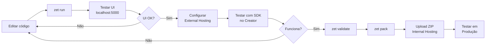

# Guia Completo: Desenvolvimento de Widgets para Zoho Creator

Este guia documenta todo o processo de criação, desenvolvimento, teste e deploy de widgets customizados para a plataforma Zoho Creator.

---

## 📚 Índice

1. [O que são Widgets](#1-o-que-são-widgets)
2. [Arquitetura e Conceitos](#2-arquitetura-e-conceitos)
3. [Configuração do Ambiente](#3-configuração-do-ambiente)
4. [Estrutura do Projeto](#4-estrutura-do-projeto)
5. [Desenvolvimento do Widget](#5-desenvolvimento-do-widget)
6. [Custom APIs e Deluge](#6-custom-apis-e-deluge)
7. [Fluxo de Desenvolvimento e Testes](#7-fluxo-de-desenvolvimento-e-testes)
8. [Deploy e Publicação](#8-deploy-e-publicação)
9. [Limitações e Considerações](#9-limitações-e-considerações)
10. [Referências](#10-referências)

---

## 1. O que são Widgets

### 1.1 Definição

Widgets são **componentes customizados** desenvolvidos em HTML, CSS e JavaScript que estendem as capacidades do Zoho Creator além das funcionalidades nativas. Eles permitem criar interfaces personalizadas e funcionalidades que não estão disponíveis nativamente na plataforma.

### 1.2 Capacidades dos Widgets

| Capacidade                       | Descrição                                                                  |
| -------------------------------- | -------------------------------------------------------------------------- |
| **Funcionalidades Customizadas** | Criar features específicas que não existem nativamente no Creator          |
| **Redesign de Interface**        | Controle total sobre o design front-end da aplicação                       |
| **Integração com Terceiros**     | Incorporar bibliotecas, plugins e serviços externos                        |
| **Manipulação de Dados**         | CRUD completo via JS API (adicionar, buscar, atualizar, deletar registros) |
| **Formulários Avançados**        | Criar formulários progressivos, multi-step, com validações customizadas    |

### 1.3 Casos de Uso Comuns

- Dashboards customizados com gráficos avançados
- Formulários multi-etapas (wizard)
- Integrações com mapas (Google Maps, Leaflet)
- Calendários customizados
- Timers e contadores
- Interfaces de e-commerce
- Formulários de pedidos complexos

---

## 2. Arquitetura e Conceitos

### 2.1 Fluxo de Comunicação

```
┌─────────────────────────────────────────────────────────────────┐
│                        ZOHO CREATOR                              │
│  ┌─────────────────┐    ┌──────────────┐    ┌────────────────┐  │
│  │     Widget      │───▶│  Custom API  │───▶│ Custom Function│  │
│  │  (HTML/CSS/JS)  │◀───│  (Endpoint)  │◀───│   (Deluge)     │  │
│  └─────────────────┘    └──────────────┘    └────────────────┘  │
│          │                                          │            │
│          │              ┌──────────────┐            │            │
│          └─────────────▶│   Reports    │◀───────────┘            │
│                         │   Forms      │                         │
│                         │   Database   │                         │
│                         └──────────────┘                         │
└─────────────────────────────────────────────────────────────────┘
```

### 2.2 Tipos de Hospedagem

| Tipo                 | Descrição                                               | Uso Recomendado        |
| -------------------- | ------------------------------------------------------- | ---------------------- |
| **Internal Hosting** | Widget hospedado dentro do Zoho Creator (upload do ZIP) | Produção               |
| **External Hosting** | Widget hospedado em servidor externo (URL)              | Desenvolvimento/Testes |

### 2.3 JS API Versions

| Versão | CDN URL                                                                  | Notas       |
| ------ | ------------------------------------------------------------------------ | ----------- |
| **V2** | `https://js.zohostatic.com/creator/widgets/version/2.0/widgetsdk-min.js` | Recomendada |
| **V1** | `https://js.zohostatic.com/creator/widgets/version/1.0/widgetsdk-min.js` | Legacy      |

> [!IMPORTANT]
> A versão do CDN determina quais métodos estão disponíveis. Não é possível misturar métodos de versões diferentes.

---

## 3. Configuração do Ambiente

### 3.1 Pré-requisitos

1. **Node.js** (v14 ou superior)
2. **npm** (geralmente instalado com Node.js)
3. **Editor de código** (VS Code recomendado)
4. **Acesso a uma conta Zoho Creator**

### 3.2 Instalação do ZET (Zoho Extension Toolkit)

O ZET é a ferramenta de linha de comando oficial para desenvolvimento de widgets.

```bash
# Verificar se Node.js está instalado
node -v
npm -v

# Instalar ZET globalmente
npm install -g zoho-extension-toolkit

# Verificar instalação
zet --version
# ou apenas
zet
```

### 3.3 Comandos Disponíveis do ZET

| Comando        | Descrição                                   |
| -------------- | ------------------------------------------- |
| `zet init`     | Criar novo projeto de widget                |
| `zet run`      | Iniciar servidor local para desenvolvimento |
| `zet validate` | Validar o pacote do widget                  |
| `zet pack`     | Empacotar widget em arquivo ZIP             |

---

## 4. Estrutura do Projeto

### 4.1 Criar Novo Projeto

```bash
# Navegar para pasta desejada
cd C:\meus-projetos

# Iniciar novo projeto
zet init

# Selecionar: Zoho Creator
# Informar nome do projeto: MeuWidget
```

### 4.2 Estrutura de Pastas

```
MeuWidget/
├── app/
│   ├── widget.html           # Arquivo principal do widget
│   └── plugin-manifest.json  # Configurações e campos dinâmicos
├── dist/                     # Gerado após 'zet pack'
│   └── MeuWidget.zip         # Arquivo para upload
└── node_modules/             # Dependências (se houver)
```

### 4.3 Arquivo plugin-manifest.json

Este arquivo define configurações do widget e campos que podem ser mapeados dinamicamente.

```json
{
  "service": "CREATOR",
  "cspDomains": {
    "connect-src": ["https://api.exemplo.com"]
  },
  "config": [
    {
      "name": "welcomeText",
      "type": "string",
      "defaultValue": "Bem-vindo!",
      "placeholder": "Digite uma mensagem",
      "help": "Mensagem exibida ao usuário",
      "mandatory": false
    },
    {
      "name": "appName",
      "type": "Application"
    },
    {
      "name": "formPedidos",
      "type": "Form",
      "help": "Selecione o formulário de pedidos",
      "mandatory": true
    },
    {
      "name": "reportProdutos",
      "type": "Report"
    },
    {
      "name": "campoQuantidade",
      "type": "Field"
    }
  ]
}
```

#### Tipos de Campos Configuráveis

| Tipo          | Descrição             |
| ------------- | --------------------- |
| `string`      | Texto livre           |
| `integer`     | Número inteiro        |
| `float`       | Número decimal        |
| `boolean`     | Verdadeiro/Falso      |
| `Application` | Seletor de aplicação  |
| `Form`        | Seletor de formulário |
| `Report`      | Seletor de relatório  |
| `Field`       | Seletor de campo      |

#### Propriedades dos Campos

| Propriedade    | Tipo    | Limite    | Descrição                         |
| -------------- | ------- | --------- | --------------------------------- |
| `name`         | string  | 50 chars  | Identificador único (obrigatório) |
| `type`         | string  | -         | Tipo do campo (obrigatório)       |
| `defaultValue` | any     | 40 chars  | Valor padrão                      |
| `placeholder`  | string  | -         | Placeholder do input              |
| `help`         | string  | 140 chars | Texto de ajuda                    |
| `mandatory`    | boolean | -         | Se é obrigatório                  |

---

## 5. Desenvolvimento do Widget

### 5.1 Template Base do Widget

```html
<!DOCTYPE html>
<html lang="pt-BR">
  <head>
    <meta charset="UTF-8" />
    <meta name="viewport" content="width=device-width, initial-scale=1.0" />
    <title>Meu Widget</title>

    <!-- SDK do Zoho Creator v2 (OBRIGATÓRIO) -->
    <script src="https://js.zohostatic.com/creator/widgets/version/2.0/widgetsdk-min.js"></script>

    <style>
      /* ============================================
           CSS DO WIDGET
           ============================================ */

      * {
        box-sizing: border-box;
        margin: 0;
        padding: 0;
      }

      body {
        font-family: "Segoe UI", Tahoma, Geneva, Verdana, sans-serif;
        background-color: #f5f5f5;
        padding: 20px;
      }

      .container {
        max-width: 800px;
        margin: 0 auto;
        background: white;
        border-radius: 8px;
        box-shadow: 0 2px 10px rgba(0, 0, 0, 0.1);
        padding: 24px;
      }

      .header {
        border-bottom: 2px solid #0078d4;
        padding-bottom: 16px;
        margin-bottom: 24px;
      }

      .header h1 {
        color: #333;
        font-size: 24px;
      }

      .form-group {
        margin-bottom: 16px;
      }

      .form-group label {
        display: block;
        margin-bottom: 6px;
        font-weight: 600;
        color: #555;
      }

      .form-group input,
      .form-group select,
      .form-group textarea {
        width: 100%;
        padding: 10px 12px;
        border: 1px solid #ddd;
        border-radius: 4px;
        font-size: 14px;
        transition: border-color 0.2s;
      }

      .form-group input:focus,
      .form-group select:focus,
      .form-group textarea:focus {
        outline: none;
        border-color: #0078d4;
      }

      .btn {
        padding: 12px 24px;
        border: none;
        border-radius: 4px;
        font-size: 14px;
        font-weight: 600;
        cursor: pointer;
        transition: background-color 0.2s;
      }

      .btn-primary {
        background-color: #0078d4;
        color: white;
      }

      .btn-primary:hover {
        background-color: #006cbd;
      }

      .btn-secondary {
        background-color: #f0f0f0;
        color: #333;
      }

      .loading {
        display: none;
        text-align: center;
        padding: 20px;
      }

      .loading.active {
        display: block;
      }

      .error-message {
        background-color: #fde7e7;
        border: 1px solid #f5c6c6;
        color: #c00;
        padding: 12px;
        border-radius: 4px;
        margin-bottom: 16px;
        display: none;
      }

      .success-message {
        background-color: #e7f5e7;
        border: 1px solid #c6f5c6;
        color: #0a0;
        padding: 12px;
        border-radius: 4px;
        margin-bottom: 16px;
        display: none;
      }
    </style>
  </head>
  <body>
    <div class="container">
      <div class="header">
        <h1>Formulário de Pedidos</h1>
      </div>

      <div id="error-message" class="error-message"></div>
      <div id="success-message" class="success-message"></div>

      <div id="loading" class="loading">
        <p>Carregando...</p>
      </div>

      <form id="pedido-form">
        <div class="form-group">
          <label for="cliente">Cliente</label>
          <select id="cliente" name="cliente" required>
            <option value="">Selecione um cliente</option>
          </select>
        </div>

        <div class="form-group">
          <label for="produto">Produto</label>
          <select id="produto" name="produto" required>
            <option value="">Selecione um produto</option>
          </select>
        </div>

        <div class="form-group">
          <label for="quantidade">Quantidade</label>
          <input
            type="number"
            id="quantidade"
            name="quantidade"
            min="1"
            value="1"
            required
          />
        </div>

        <div class="form-group">
          <label for="observacoes">Observações</label>
          <textarea id="observacoes" name="observacoes" rows="3"></textarea>
        </div>

        <div style="display: flex; gap: 12px; margin-top: 24px;">
          <button type="submit" class="btn btn-primary">Criar Pedido</button>
          <button type="reset" class="btn btn-secondary">Limpar</button>
        </div>
      </form>
    </div>

    <script>
      /* ============================================
           JAVASCRIPT DO WIDGET
           ============================================ */

      // Variáveis globais
      var clientes = [];
      var produtos = [];

      // ============================================
      // INICIALIZAÇÃO
      // ============================================

      // Aguardar DOM carregar
      document.addEventListener("DOMContentLoaded", function () {
        // Inicializar SDK do Zoho Creator
        ZOHO.CREATOR.init()
          .then(function () {
            console.log("SDK inicializado com sucesso");
            inicializarWidget();
          })
          .catch(function (error) {
            console.error("Erro ao inicializar SDK:", error);
            mostrarErro("Erro ao conectar com Zoho Creator");
          });
      });

      function inicializarWidget() {
        mostrarLoading(true);

        // Carregar dados iniciais em paralelo
        Promise.all([carregarClientes(), carregarProdutos()])
          .then(function () {
            mostrarLoading(false);
            console.log("Widget inicializado");
          })
          .catch(function (error) {
            mostrarLoading(false);
            mostrarErro("Erro ao carregar dados: " + error.message);
          });
      }

      // ============================================
      // CHAMADAS À CUSTOM API
      // ============================================

      function carregarClientes() {
        var config = {
          api_name: "listar_clientes",
          http_method: "GET",
        };

        return ZOHO.CREATOR.DATA.invokeCustomApi(config).then(function (
          response
        ) {
          console.log("Clientes:", response);
          clientes = response.data || [];
          popularSelectClientes();
          return clientes;
        });
      }

      function carregarProdutos() {
        var config = {
          api_name: "listar_produtos",
          http_method: "GET",
        };

        return ZOHO.CREATOR.DATA.invokeCustomApi(config).then(function (
          response
        ) {
          console.log("Produtos:", response);
          produtos = response.data || [];
          popularSelectProdutos();
          return produtos;
        });
      }

      function criarPedido(dadosPedido) {
        var config = {
          api_name: "criar_pedido",
          http_method: "POST",
          content_type: "application/json",
          payload: dadosPedido,
        };

        return ZOHO.CREATOR.DATA.invokeCustomApi(config);
      }

      // ============================================
      // MANIPULAÇÃO DO DOM
      // ============================================

      function popularSelectClientes() {
        var select = document.getElementById("cliente");
        select.innerHTML = '<option value="">Selecione um cliente</option>';

        clientes.forEach(function (cliente) {
          var option = document.createElement("option");
          option.value = cliente.ID;
          option.textContent = cliente.Nome;
          select.appendChild(option);
        });
      }

      function popularSelectProdutos() {
        var select = document.getElementById("produto");
        select.innerHTML = '<option value="">Selecione um produto</option>';

        produtos.forEach(function (produto) {
          var option = document.createElement("option");
          option.value = produto.ID;
          option.textContent = produto.Nome + " - R$ " + produto.Preco;
          select.appendChild(option);
        });
      }

      // ============================================
      // HANDLERS DE EVENTOS
      // ============================================

      document
        .getElementById("pedido-form")
        .addEventListener("submit", function (e) {
          e.preventDefault();

          var dadosPedido = {
            cliente_id: document.getElementById("cliente").value,
            produto_id: document.getElementById("produto").value,
            quantidade: parseInt(document.getElementById("quantidade").value),
            observacoes: document.getElementById("observacoes").value,
          };

          // Validação
          if (!dadosPedido.cliente_id || !dadosPedido.produto_id) {
            mostrarErro("Selecione cliente e produto");
            return;
          }

          mostrarLoading(true);

          criarPedido(dadosPedido)
            .then(function (response) {
              mostrarLoading(false);
              mostrarSucesso("Pedido criado com sucesso!");
              document.getElementById("pedido-form").reset();
            })
            .catch(function (error) {
              mostrarLoading(false);
              mostrarErro("Erro ao criar pedido: " + error.message);
            });
        });

      // ============================================
      // UTILIDADES
      // ============================================

      function mostrarLoading(show) {
        document.getElementById("loading").classList.toggle("active", show);
      }

      function mostrarErro(mensagem) {
        var elem = document.getElementById("error-message");
        elem.textContent = mensagem;
        elem.style.display = "block";

        setTimeout(function () {
          elem.style.display = "none";
        }, 5000);
      }

      function mostrarSucesso(mensagem) {
        var elem = document.getElementById("success-message");
        elem.textContent = mensagem;
        elem.style.display = "block";

        setTimeout(function () {
          elem.style.display = "none";
        }, 5000);
      }
    </script>
  </body>
</html>
```

### 5.2 Acessando Configurações do Manifest

Os valores configurados no `plugin-manifest.json` podem ser acessados via JavaScript:

```javascript
// Obter valores de configuração
ZOHO.CREATOR.UTIL.getWidgetData().then(function (data) {
  console.log("Dados do widget:", data);

  // Acessar valores específicos
  var welcomeText = data.config.welcomeText;
  var appName = data.config.appName;
  var formPedidos = data.config.formPedidos;
});
```

---

## 6. Custom APIs e Deluge

### 6.1 Por que usar Custom APIs?

Em vez de usar as APIs REST padrão v2 (que são mais "travadas"), você pode criar Custom Functions em Deluge e expô-las através de Custom APIs. Isso oferece:

- **Flexibilidade**: Toda lógica de negócio fica no Deluge
- **Segurança**: Controle granular de permissões
- **Performance**: Lógica executada no servidor Zoho
- **Manutenibilidade**: Código centralizado

### 6.2 Criar Custom Function

No Zoho Creator:

1. Vá em **Settings → Custom Functions**
2. Clique em **+ New Function**
3. Defina nome e parâmetros
4. Escreva a lógica em Deluge

#### Exemplo: Listar Produtos

```deluge
// Nome: listarProdutos
// Parâmetros: (nenhum)
// Retorno: Map

// Buscar todos os produtos ativos
produtos = Produtos[Status == "Ativo"];

// Construir resposta
listaFormatada = List();
for each produto in produtos
{
    item = Map();
    item.put("ID", produto.ID);
    item.put("Nome", produto.Nome);
    item.put("Preco", produto.Preco);
    item.put("Estoque", produto.Estoque);
    listaFormatada.add(item);
}

// Retornar
response = Map();
response.put("data", listaFormatada);
response.put("total", listaFormatada.size());
return response;
```

#### Exemplo: Criar Pedido

```deluge
// Nome: criarPedido
// Parâmetros: cliente_id (bigint), produto_id (bigint), quantidade (int), observacoes (text)
// Retorno: Map

// Buscar cliente e produto
cliente = Clientes[ID == cliente_id];
produto = Produtos[ID == produto_id];

// Validações
if(cliente.count() == 0)
{
    return {"erro": true, "mensagem": "Cliente não encontrado"};
}
if(produto.count() == 0)
{
    return {"erro": true, "mensagem": "Produto não encontrado"};
}
if(produto.Estoque < quantidade)
{
    return {"erro": true, "mensagem": "Estoque insuficiente"};
}

// Calcular valores
valorUnitario = produto.Preco;
valorTotal = valorUnitario * quantidade;

// Criar pedido
novoPedido = insert into Pedidos
[
    Cliente = cliente.ID,
    Produto = produto.ID,
    Quantidade = quantidade,
    Valor_Unitario = valorUnitario,
    Valor_Total = valorTotal,
    Observacoes = observacoes,
    Status = "Pendente",
    Data_Criacao = zoho.currentdate
];

// Atualizar estoque
produto.Estoque = produto.Estoque - quantidade;

// Retornar sucesso
return {
    "erro": false,
    "mensagem": "Pedido criado com sucesso",
    "pedido_id": novoPedido.ID
};
```

### 6.3 Expor como Custom API

1. Vá em **Settings → Microservices → Custom APIs**
2. Clique em **+ New Custom API**
3. Configure:

| Campo              | Valor                       |
| ------------------ | --------------------------- |
| **Nome**           | `listar_produtos`           |
| **Método HTTP**    | GET                         |
| **Link Function**  | `listarProdutos`            |
| **Authentication** | OAuth2 ou Public Key        |
| **User Scope**     | Portal users (para widgets) |

4. Salve e copie o **Link Name** (usado no widget)

### 6.4 Chamar do Widget

```javascript
// GET - Listar produtos
function listarProdutos() {
  var config = {
    api_name: "listar_produtos", // Link Name da Custom API
    http_method: "GET",
  };

  return ZOHO.CREATOR.DATA.invokeCustomApi(config)
    .then(function (response) {
      console.log("Produtos:", response);
      return response.data;
    })
    .catch(function (error) {
      console.error("Erro:", error);
      throw error;
    });
}

// POST - Criar pedido
function criarPedido(dados) {
  var config = {
    api_name: "criar_pedido",
    http_method: "POST",
    content_type: "application/json",
    payload: {
      cliente_id: dados.clienteId,
      produto_id: dados.produtoId,
      quantidade: dados.quantidade,
      observacoes: dados.observacoes,
    },
  };

  return ZOHO.CREATOR.DATA.invokeCustomApi(config).then(function (response) {
    if (response.erro) {
      throw new Error(response.mensagem);
    }
    return response;
  });
}
```

### 6.5 Parâmetros do invokeCustomApi

| Parâmetro        | Tipo   | Obrigatório        | Descrição                                   |
| ---------------- | ------ | ------------------ | ------------------------------------------- |
| `api_name`       | string | Sim                | Link Name da Custom API                     |
| `http_method`    | string | Sim                | GET, POST, PUT, DELETE                      |
| `workspace_name` | string | Não                | Nome do workspace                           |
| `content_type`   | string | Não                | `application/json` ou `multipart/form-data` |
| `payload`        | object | Para POST/PUT      | Dados em JSON                               |
| `query_params`   | object | Para GET/DELETE    | Parâmetros de query                         |
| `public_key`     | string | Se usar Public Key | Chave pública                               |

---

## 7. Fluxo de Desenvolvimento e Testes

### 7.1 Ciclo de Desenvolvimento



### 7.2 Rodar Localmente

```bash
# Na pasta do projeto
cd MeuWidget

# Iniciar servidor de desenvolvimento
zet run

# Servidor inicia em http://127.0.0.1:5000
```

Acesse: `http://127.0.0.1:5000/app/widget.html`

> [!WARNING] > **O SDK do Zoho (`ZOHO.CREATOR.*`) NÃO funciona em `zet run`!**
> O servidor local serve apenas para testar a interface visual (HTML/CSS).

### 7.3 Testar com SDK Funcionando

Para testar chamadas reais à API do Zoho:

1. No Zoho Creator: **Settings → Widgets → Create**
2. Escolha **External Hosting**
3. Informe URL: `https://127.0.0.1:5000/app/widget.html`
4. Adicione o widget a uma página
5. Acesse a página pelo Creator
6. Agora o SDK funciona e você pode testar as APIs

> [!TIP]
> Use `console.log()` liberalmente para debugar. Abra o DevTools (F12) para ver os logs.

### 7.4 Validar e Empacotar

```bash
# Validar estrutura e arquivos
zet validate

# Se houver erros, corrija-os antes de prosseguir

# Gerar ZIP para upload
zet pack

# O arquivo será criado em: dist/MeuWidget.zip
```

---

## 8. Deploy e Publicação

### 8.1 Upload do Widget (Internal Hosting)

1. No Zoho Creator, vá em **Settings → Widgets**
2. Clique em **Create** (ou edite um existente)
3. Preencha:
   - **Widget Name**: Nome do widget
   - **Hosting**: Internal
   - **Widget File**: Selecione o ZIP da pasta `dist/`
   - **Index File**: `/widget.html` (ou `/app/widget.html` dependendo da estrutura)
4. Clique em **Create**

### 8.2 Adicionar Widget a uma Página

1. Vá para a página onde quer adicionar o widget
2. Clique em **Edit Page** ou **Page Builder**
3. Na biblioteca de componentes, encontre **Widgets**
4. Arraste seu widget para a área desejada
5. Se tiver campos configuráveis (manifest.json), preencha-os no painel lateral
6. Clique em **Done** para salvar

### 8.3 Atualizar Widget Existente

Para atualizar um widget já publicado:

1. Faça as alterações no código
2. Execute `zet validate` e `zet pack`
3. Vá em **Settings → Widgets**
4. Clique no widget existente
5. Clique em **Update** e selecione o novo ZIP
6. Salve

> [!NOTE]
> Após atualizar, pode ser necessário atualizar a página do navigador (F5) para ver as mudanças.

---

## 9. Limitações e Considerações

### 9.1 Limites de Widgets

| Limite                     | Valor          |
| -------------------------- | -------------- |
| Widgets por conta          | 50             |
| Tamanho máximo do ZIP      | 10 MB          |
| Arquivos por ZIP           | 250            |
| Tamanho por arquivo        | 5 MB           |
| Nome do ZIP                | 100 caracteres |
| Nome dos arquivos internos | 50 caracteres  |

### 9.2 Caracteres Permitidos

- **Nome do ZIP**: A-Z, a-z, 0-9, `_`, `\`, `$`, `.`, `-`
- **Nomes de arquivos**: A-Z, a-z, 0-9, `_`, `.`, `$`, `-`
- **Nomes de pastas**: A-Z, a-z, 0-9, `_`, `$`, `-`

### 9.3 Tipos de Arquivo Suportados

`.txt`, `.md`, `.xml`, `.dre`, `.jpg`, `.jpeg`, `.png`, `.gif`, `.css`, `.js`, `.html`, `.json`, `.mp3`, `.svg`, `.woff`, `.ttf`, `.eot`, `.otf`, `.woff2`, `.webm`, `.mp4`

### 9.4 Limitações Importantes

| Limitação              | Descrição                                                                                        |
| ---------------------- | ------------------------------------------------------------------------------------------------ |
| **Páginas Publicadas** | Widgets com JS APIs (CRUD) NÃO funcionam em páginas públicas. Apenas **Publish APIs** funcionam. |
| **CDN Obrigatório**    | O arquivo HTML DEVE incluir o CDN do SDK do Zoho                                                 |
| **zet pack**           | O ZIP DEVE ser gerado com `zet pack`. ZIP criado de outra forma não funciona.                    |
| **Campos Únicos**      | No manifest.json, cada `name` deve ser único                                                     |
| **Componentes**        | Apenas um campo de cada tipo de componente (Application, Form, Report) por manifest              |

### 9.5 Considerações de Segurança

- Custom APIs podem ser configuradas como **OAuth2** ou **Public Key**
- Para widgets internos, use **User Scope: Portal users**
- Nunca exponha credenciais sensíveis no código JavaScript
- Valide dados no Deluge (servidor), não apenas no JavaScript (cliente)

---

## 10. Referências

### 10.1 Documentação Oficial

| Recurso           | URL                                                                               |
| ----------------- | --------------------------------------------------------------------------------- |
| Entender Widgets  | https://www.zoho.com/creator/newhelp/app-settings/widgets/understand-widgets.html |
| Instalar CLI      | https://www.zoho.com/creator/newhelp/app-settings/widgets/install-cli.html        |
| Criar Widget      | https://www.zoho.com/creator/newhelp/app-settings/widgets/create-a-widget.html    |
| JS API v2         | https://www.zoho.com/creator/help/js-api/v2/                                      |
| Widget de Exemplo | https://www.zoho.com/creator/newhelp/app-settings/widgets/sample-widget.html      |
| REST APIs v2.1    | https://www.zoho.com/creator/help/api/v2.1/                                       |

### 10.2 Downloads

| Recurso                 | URL                                                                     |
| ----------------------- | ----------------------------------------------------------------------- |
| Node.js                 | https://nodejs.org/en/download/                                         |
| Widget de Exemplo (ZIP) | https://www.zoho.com/sites/zweb/images/creator/widget_file/app_test.zip |

### 10.3 Suporte

- **Email**: support@zohocreator.com
- **Fórum**: https://help.zoho.com/portal/community/zoho-creator

---

## Changelog

| Data       | Versão | Descrição                   |
| ---------- | ------ | --------------------------- |
| 2024-12-30 | 1.0    | Documentação inicial criada |

---

> **Documento criado para o projeto de Widget de Formulário de Pedidos**
>
> Para dúvidas ou sugestões, consulte a documentação oficial ou entre em contato com o suporte Zoho.
